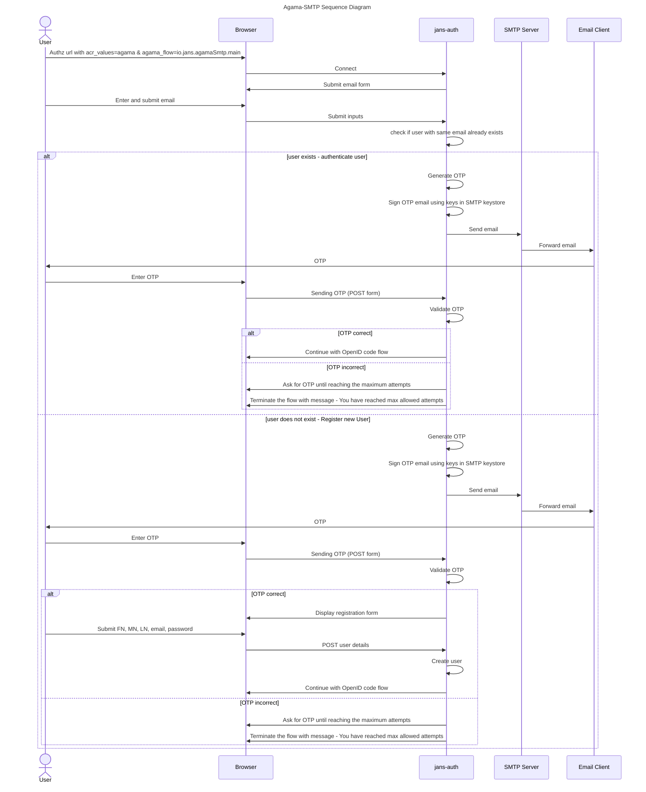

<p align="center"></p>

<!-- These are statistics for this repository-->
[![Contributors][contributors-shield]][contributors-url]
[![Forks][forks-shield]][forks-url]
[![Stargazers][stars-shield]][stars-url]
[![Issues][issues-shield]][issues-url]
[![Apache License][license-shield]][license-url]


# About Agama SMTP Project

This repo is home to the Gluu Agama-SMTP project. This Agama project provides 
email-based authentication for user registration and verification.

## Where To Deploy

The project can be deployed to any IAM server that runs an implementation of 
the [Agama Framework](https://docs.jans.io/head/agama/introduction/) like 
[Janssen Server](https://jans.io) and [Gluu Flex](https://gluu.org/flex/).

## How To Deploy

Different IAM servers may provide different methods and 
user interfaces from where an Agama project can be deployed on that server. 
The steps below show how the Agama-SMTP project can be deployed on the 
[Janssen Server](https://jans.io). 

Deployment of an Agama project involves three steps.

- [Downloading the `.gama` package from the project repository](#download-the-project)
- [Adding the `.gama` package to the IAM server](#add-the-project-to-the-server)
- [Configure the project](#configure-the-project)


#### Pre-Requisites

To send email messages, ensure you have the Jans Auth Server with 
[SMTP service](https://docs.jans.io/head/admin/config-guide/smtp-configuration/)
configured


### Download the Project

> [!TIP]
> Skip this step if you use the Janssen Server TUI tool to 
> configure this project. The TUI tool enables the download and adding of this 
> project directly from the tool, as part of the `community projects` listing. 


The project is bundled as 
[.gama package](https://docs.jans.io/head/agama/gama-format/). 
Visit the `Assets` section of the 
[Releases](https://github.com/GluuFederation/agama-smtp/releases) to download the `.gama` package.


### Add The Project To The Server

The Janssen Server provides multiple ways an Agama project can be 
deployed and configured. Either use the command-line tool, REST API, or a To send email messages, ensure you have the Jans Auth Server set up. It includes an SMTP service for sending emails, but you need to configure it before use.
TUI (text-based UI). Refer to 
[Agama project configuration page](https://docs.jans.io/head/admin/config-guide/auth-server-config/agama-project-configuration/) 
in the Janssen Server documentation for more details.

### Configure The Project

The Agama project accepts configuration parameters in the JSON format. 
Every Agama project comes with a basic sample configuration file for reference.


Below is a typical configuration of the Agama-SMTP project. As shown, it contains
configuration parameters for the [flows contained in it](#flows-in-the-project):

```
{
  "org.gluu.agama.smtp.main": {
    "minCredsRequired": 2,
    "captureLocation": true
  },
  "org.gluu.agama.smtp.emailVerification": {},
  "org.gluu.agama.smtp.registration": {}
}
```


### Test The Flow

Use any relying party implementation (like [jans-tarp](https://github.com/JanssenProject/jans/tree/main/demos/jans-tarp)) 
to send an authentication request that triggers the flow.

From the incoming authentication request, the Janssen Server reads the `ACR` 
parameter value to identify which authentication method should be used. 
To invoke the `org.gluu.agama.smtp.main` flow contained in the Agama-SMTP project, 
specify the ACR value as `agama_<qualified-name-of-the-top-level-flow>`, 
i.e `agama_org.gluu.agama.smtp.main`.


## Customize and Make It Your Own

Fork this repo to start customizing the Agama-SMTP project. It is possible to 
customize the user interface provided by the flow to suit your organization's 
branding guidelines. Or customize the overall flow behavior. Follow the best 
practices and steps listed [here](https://docs.jans.io/head/admin/developer/agama/agama-best-practices/#project-reuse-and-customizations)
to achieve these customizations in the best possible way.
This project can be reused in other Agama projects to create more complex
authentication journeys. To reuse, trigger the 
[org.gluu.agama.smtp.main](#orggluuagamasmtpmain) flow from other Agama projects.

To make it easier to visualize and customize the Agama Project, use
[Agama Lab](https://cloud.gluu.org/agama-lab/login).

## Flows In The Project

List of the flows: 

- [org.gluu.agama.smtp.main](#orggluuagamasmtpmain)

### org.gluu.agama.smtp.main

The main flow of this project is [org.gluu.agama.smtp.main](./code/org.gluu.agama.smtp.main.flow) .
In step one, the person enters their email address, to which the IDP sends an OTP code.
After OTP verification, if the email address is known, the flow is successful.
If the email address is new, the IDP displays a registration form.


# Sequence Diagram

A basic diagram to understand how the `agama-SMTP` works.




# Demo

Check out this video to see the **agama-SMTP** authentication flow in action.
Also check the
[Agama Project Of The Week](https://gluu.org/agama-project-of-the-week/) video
series for a quick demo on this flow.

*Note:*
While the video shows how the flow works overall, it may be dated. Do check the
[Test the Flow](#test-the-flow) section to understand the current
method of passing the ACR parameter when invoking the flow.


<!-- This are stats url reference for this repository -->
[contributors-shield]: https://img.shields.io/github/contributors/GluuFederation/agama-smtp.svg?style=for-the-badge
[contributors-url]: https://github.com/GluuFederation/agama-smtp/graphs/contributors
[forks-shield]: https://img.shields.io/github/forks/GluuFederation/agama-smtp.svg?style=for-the-badge
[forks-url]: https://github.com/GluuFederation/agama-smtp/network/members
[stars-shield]: https://img.shields.io/github/stars/GluuFederation/agama-smtp?style=for-the-badge
[stars-url]: https://github.com/GluuFederation/agama-smtp/stargazers
[issues-shield]: https://img.shields.io/github/issues/GluuFederation/agama-smtp.svg?style=for-the-badge
[issues-url]: https://github.com/GluuFederation/agama-smtp/issues
[license-shield]: https://img.shields.io/github/license/GluuFederation/agama-smtp.svg?style=for-the-badge
[license-url]: https://github.com/GluuFederation/agama-smtp/blob/main/LICENSE
